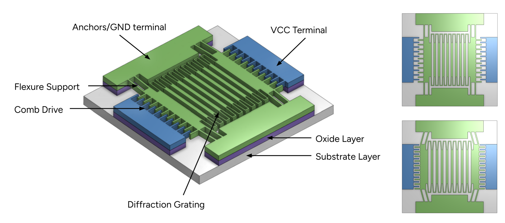
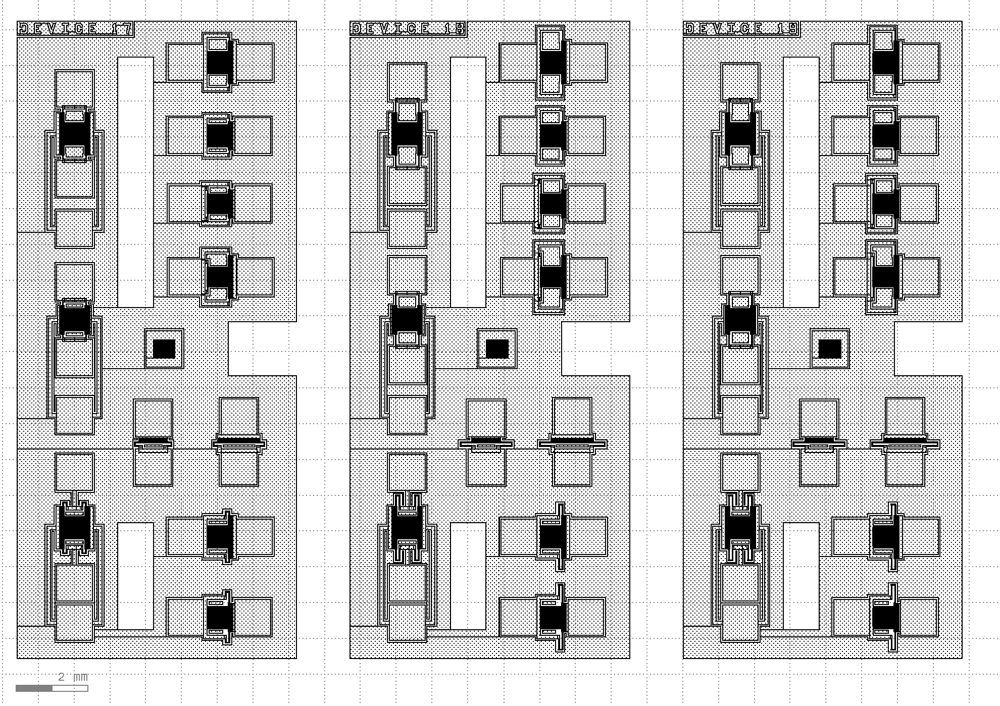
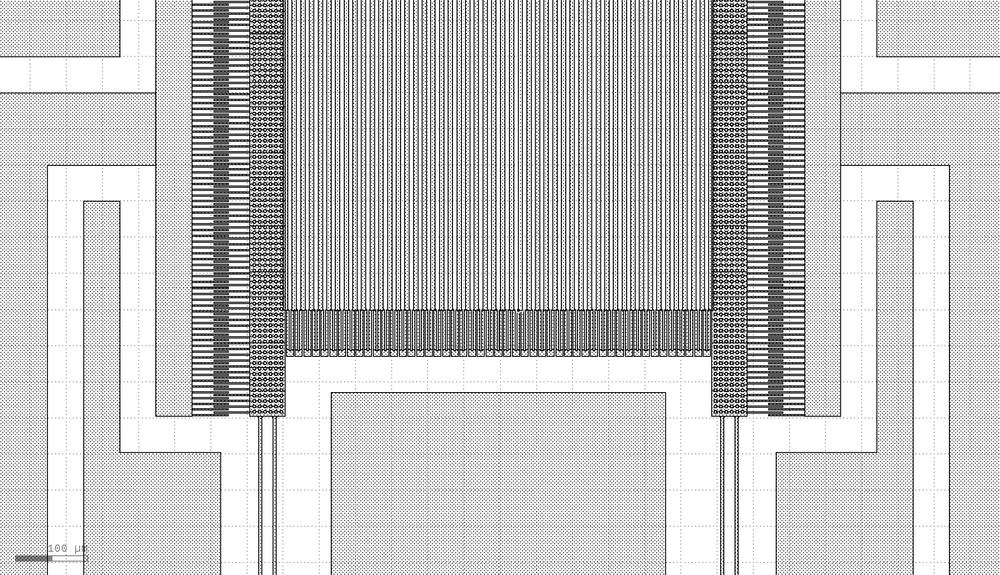
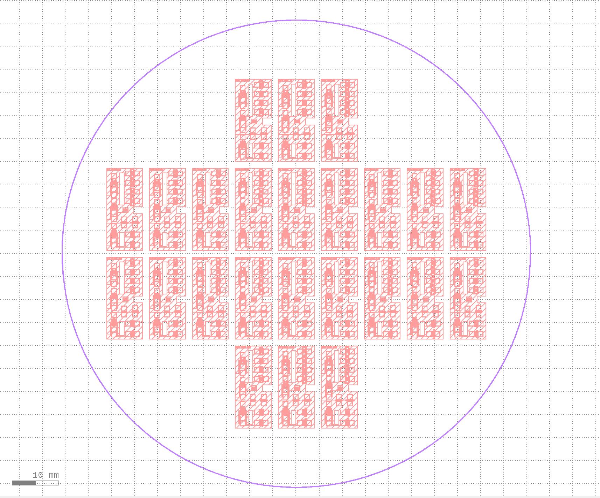

# grate-gatsby
## Tunable Optical Diffraction Grating via Electrostatic MEMS Actuation

MEMS-actuated optical diffraction gratings are a promising technology for applications in compact spectrometers and beam steering devices. This repository contains parameterized layout code for a single-mask SOI MEMS diffraction grating design, featuring a tunable grating pitch achieved through comb-drive electrostatic actuation. Each chip is designed to fit on a SOIC-28 package, with grating targets of 590 x 500 microns. Twelve devices are included on each chip: three double-sided comb drive diffraction gratings, four single-sided comb drive diffraction gratings, two comb drive testing devices (without gratings), two phase-shifting diffraction gratings (built with rigid gratings), and one fixed grating target.

[Technical paper](/img/paper.pdf)

## Design Overview
### Chip Layout

The chips are designed to be cut in groups of three to fit in the 25 x 25 mm chamber of the critical point dryer used in the fabrication process. Each device contains 1mm x 1mm pads for wire bonding (and soldering, if necessary) to the SOIC-28 package.

### Grating and Comb Drive Design

The minimum feature size is 2 microns. Truss designs are used on large rigid free-moving structures to allow the BOE etch to undercut the structures and release them from the substrate. A guardrail structure is algorithmically generated around the perimeter of all device to prevent damage during the CPD process.

### Full Wafer Layout

The full 6-inch wafer layout includes 24 chips generated from a parametric sweep over the flexure and comb drive parameters. The parameters are written to `output/device_params.csv`. The wafer itself is stored at `output/wafer_3993.gds`.

## Contributors
- Jieruei Chang, *MIT EECS*
- Keira Boone, *MIT DMSE*
- Alysha Rawji, *MIT AeroAstro*